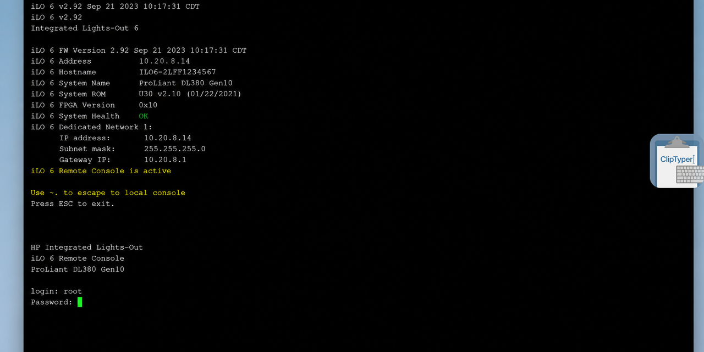

# ClipTyper

**The last mile for text that cannot be pasted.**

Type clipboard text as simulated keystrokes to bypass paste restrictions in VM consoles (vSphere, Proxmox, Hyper-V), iDRAC/iLO, RDP sessions, and paste-blocked fields.

[](https://github.com/unpaved028/ClipTyper/releases/latest)
[](https://github.com/microsoft/winget-pkgs/tree/master/manifests/u/unpaved028/ClipTyper)
[](https://github.com/unpaved028/ClipTyper/releases/latest)
[](LICENSE)
[](ClipTyper.Tests)

```powershell
winget install unpaved028.ClipTyper
```

Or grab **[ClipTyper-Setup.exe](https://github.com/unpaved028/ClipTyper/releases/latest/download/ClipTyper-Setup.exe)** · **[Portable](https://github.com/unpaved028/ClipTyper/releases/latest/download/ClipTyper-Portable.exe)** · **[All releases](https://github.com/unpaved028/ClipTyper/releases/latest)**

> **Official downloads only from GitHub Releases or Winget.** Third-party mirrors (including Softonic) may ship outdated or wrapped builds.

<p align="center">
  
</p>

<p align="center"><sub>HPE iLO remote console — paste blocked; ClipTyper types the clipboard as keystrokes (overlay on the right). An animated demo GIF can be added later; this still shot is the real product in a real console.</sub></p>

---

## Why ClipTyper?

When `Ctrl+V` is blocked or unavailable, retyping passwords and commands by hand is slow and error-prone. ClipTyper reads the Windows clipboard on your trigger and types the text character by character via native `SendInput` — no agents on the remote side, no admin rights required for normal use.

Lightweight alternative to **ClickPaste**, AutoHotkey paste scripts, or on-screen virtual keyboards — with a fullscreen RDP overlay, credential auto-type, Winget installs, and an explicit [zero-telemetry](SECURITY.md) policy.

---

## Target scenarios / tested with

| Environment | Why paste fails | What to use |
|---|---|---|
| **VMware vSphere / VMRC** | Console has no (or blocked) clipboard channel | Delay 30–45 ms · Unicode or VK mode |
| **Proxmox VE noVNC / SPICE** | Browser console ≠ OS clipboard | Delay 30–45 ms · Unicode · Newline: Enter |
| **Hyper-V VM Connection** | Limited clipboard bridging | Delay 25–40 ms · Unicode |
| **Dell iDRAC / HPE iLO / IPMI HTML5** | Canvas console accepts keystrokes only | Delay 40–60 ms · **VK Compatibility Mode** |
| **KVM-over-IP** (Raritan and similar) | No clipboard pipe into the session | Overlay or hotkey · slower delay if laggy |
| **RDP / Citrix / Horizon** (clipboard GPO-blocked) | Redirection disabled by policy | Hotkey in windowed mode · **Overlay** in fullscreen |
| **AWS EC2 / Azure Serial Console** | Raw TTY stream | Plain-text enforcement · Delay ~30 ms |
| **MS Teams / Zoom remote control** | Viewer clipboard not bridged | **VK Compatibility Mode** · Newline: Shift+Enter for chat |
| **Paste-blocked web/password fields** | `onpaste` / JS blocks clipboard | Credential Auto-Type · optional clipboard auto-clear |

> Tested another console? Open a [Target Compatibility Report](https://github.com/unpaved028/ClipTyper/issues/new?template=target_compatibility.md).

### Quick settings cheat sheet

| Target | Recommended settings |
|---|---|
| RDP windowed | Delay `25 ms` · Unicode · `Ctrl + Shift + T` |
| RDP fullscreen | Delay `25 ms` · Unicode · **Floating Overlay** (`Ctrl + Shift + H` to toggle) |
| Citrix / Horizon | Delay `35–50 ms` · Unicode or VK |
| iLO / iDRAC HTML5 | Delay `40–60 ms` · **VK Compatibility Mode** |

---

## Download & installation

### Winget (recommended)

```powershell
winget install unpaved028.ClipTyper
```

### Manual download

| Variant | Description | .NET Runtime? | Download |
|---|---|---|---|
| **Installer** | Non-admin Setup.exe — Start Menu + Autostart | No | **[ClipTyper-Setup.exe](https://github.com/unpaved028/ClipTyper/releases/latest/download/ClipTyper-Setup.exe)** |
| **Portable** | Self-contained single `.exe` | No | **[ClipTyper-Portable.exe](https://github.com/unpaved028/ClipTyper/releases/latest/download/ClipTyper-Portable.exe)** |
| **Slim** | ~1.5 MB; needs .NET 8 Desktop Runtime | [Yes](https://dotnet.microsoft.com/download/dotnet/8.0/runtime) | **[ClipTyper-Slim.exe](https://github.com/unpaved028/ClipTyper/releases/latest/download/ClipTyper-Slim.exe)** |

Not sure? Use the **Installer**.

Integrity:
- Checksums: [`SHA256SUMS.txt`](https://github.com/unpaved028/ClipTyper/releases/latest) on every release
- **ClipTyper-Setup.exe (v1.6.1)** SHA-256: `aa6c70205c1ef8568db390cdfe0bbc68f1c7a844f8fd2e94838ec3c5bba28e73`
- VirusTotal: [**0 detections** / 68 engines](https://www.virustotal.com/gui/file/aa6c70205c1ef8568db390cdfe0bbc68f1c7a844f8fd2e94838ec3c5bba28e73) on the current installer (re-scan after each release; unsigned `SendInput` tools can still trip heuristics later — see [SECURITY.md](SECURITY.md))

---

## Trust & privacy

- **Zero telemetry** — no analytics and no product metrics. See [SECURITY.md](SECURITY.md).
- **Clipboard stays local** — read only when you trigger typing; never written to disk or sent to a server.
- **Almost offline** — the only network call is an **optional** GitHub Releases update check (off in Settings). No other outbound traffic.
- **Open source (MIT)** — review the code; verify release checksums.
- **UIPI respected** — non-elevated ClipTyper will not silently type into Administrator windows.

---

## Features

- Paste anywhere paste is blocked — RDP, KVM, web consoles, locked password fields
- **Credential Auto-Type** — two-stage username/password with Tab / Newline / custom delimiters
- Flexible newlines — `Enter`, `Shift + Enter`, `Space`, or `Ignore`
- Plain-text clipboard preference (skip RTF/HTML)
- Optional humanized typing jitter (±1–50 ms)
- Portable single-exe or non-admin installer
- `SendInput` Unicode typing + optional **VK Compatibility Mode**
- Escape abort, focus-loss protection, single-instance guard, long-text confirmation, input sanitization
- Floating **overlay** for fullscreen RDP (edge snap, multi-monitor, scale 25–200%)
- Configurable hotkeys (type + overlay toggle)
- Optional auto update check with tray/overlay badge

---

## Usage

### Hotkey

1. Start ClipTyper — tray icon appears  
2. Copy text (`Ctrl+C`)  
3. Focus the target window  
4. Press **`Ctrl + Shift + T`** — ClipTyper types the clipboard  

Press **`Escape`** (or tray **Stop Typing**) to abort.

### Overlay (fullscreen RDP / KVM)

Global hotkeys are often captured by the remote session. Enable **Show Overlay Button** in Settings (or toggle with **`Ctrl + Shift + H`**), hover the edge icon, click to type into the previously focused window.

---

## Settings

Right-click the tray icon → **Settings**:

| Setting | Description | Default |
|---|---|---|
| **Trigger Hotkey** | Shortcut to start typing | `Ctrl + Shift + T` |
| **Keystroke Delay** | Delay between keystrokes (5–100 ms) | 25 ms |
| **Newline Handling** | `Enter`, `Shift + Enter`, `Space`, or `Ignore` | `Enter` |
| **Enforce Plain-Text** | Prefer plain-text clipboard format | Disabled |
| **Typing Jitter** | Random variance 1–50 ms (default ±5 ms) | Disabled |
| **Credential Auto-Type** | Two-stage login via delimiter detection | Disabled |
| **Custom Transition Key** | `Tab` or `Enter` between credential parts | `Tab` |
| **Stage Pause** | Pause between username and password (50–2000 ms) | 200 ms |
| **Auto-Clear Clipboard** | Clear clipboard after credential typing | Disabled |
| **Clean Text** | Strip BOM, nulls, zero-width chars | Enabled |
| **Confirm Before Long Text** | Confirm before very long clipboard text | Enabled (> 5,000 chars) |
| **VK Compatibility Mode** | Map chars to virtual keycodes (Teams / RDP / canvas) | Disabled |
| **Play Sound Signal** | Sound when typing finishes | Disabled |
| **Diagnostic Logging** | Local `clip-typer.log` (non-sensitive) | Enabled |
| **Show Overlay Button** | Floating overlay | Disabled |
| **Scale** | Overlay size 25–200% | 100% |
| **Monitor** | Overlay display | Primary |
| **Overlay Toggle Hotkey** | Show/hide overlay (can disable) | `Ctrl + Shift + H` |
| **Reset Position** | Reset overlay to default edge position | — |
| **Run at Startup** | *(Installed)* Start with Windows | Enabled |
| **Automatically check for updates** | GitHub check on launch (max 1× / 24 h) | Enabled |

---

## How it works

```
Clipboard text → SendInput (Unicode or VK keystrokes) → Focused window
```

- Background typing worker; UI stays responsive  
- Single typing session at a time  
- User-space only (HKCU autostart) — no admin required for normal installs  

---

## Building from source

```bash
git clone https://github.com/unpaved028/ClipTyper.git
cd ClipTyper
dotnet test ClipTyper.sln -c Release

# Portable (self-contained + portable.marker)
dotnet publish -c Release -r win-x64 --self-contained true /p:PublishSingleFile=true /p:IncludeNativeLibrariesForSelfExtract=true -o ./publish-portable
New-Item -Path ./publish-portable/portable.marker -ItemType File

# Slim (framework-dependent + portable.marker)
dotnet publish -c Release -r win-x64 --self-contained false /p:PublishSingleFile=true -o ./publish-slim
New-Item -Path ./publish-slim/portable.marker -ItemType File

# Winget / installed mode (no marker; settings in AppData)
dotnet publish -c Release -r win-x64 --self-contained true /p:PublishSingleFile=true /p:IncludeNativeLibrariesForSelfExtract=true -o ./publish-winget

# Installer (Inno Setup)
iscc /DMyAppVersion=1.6.1 setup.iss
```

Requires [.NET 8 SDK](https://dotnet.microsoft.com/download/dotnet/8.0).

---

## Changelog

### v1.6.1
- Stop Typing from tray, overlay menu, or active overlay click
- Target compatibility matrix for RDP, Citrix, Horizon, iLO/iDRAC, serial consoles
- Security policy & zero-telemetry commitment (`SECURITY.md`)
- Portable read-only media fallback to LocalAppData
- Diagnostic logging toggle; clearer tray balloons
- Custom credential transition key (`Tab` / `Enter`)
- `SHA256SUMS.txt` on every release; hermetic tests & analysis cleanup

### v1.6.0
- Credential Auto-Type (Tab / Newline / custom delimiters)
- Credential safety (no password logging, focus check, optional clipboard clear)
- Configurable newlines, plain-text mode, typing jitter
- `TypingService` isolation and stability fixes

### v1.5.1
- Installer graceful shutdown while ClipTyper is running

### v1.5.0
- Escape / focus-loss abort, single-instance guard
- VK compatibility mode, input sanitization, long-text confirmation
- UIPI elevation warning, overlay/tray progress, rotating log

### v1.4.0
- Inno Setup installer, overlay scaling & multi-monitor, edge peek, overlay toggle hotkey

### v1.2.0
- Manual update check; blocked hotkey validation  
- **Deprecated for download — use [latest release](https://github.com/unpaved028/ClipTyper/releases/latest).**

---

## License

[MIT](LICENSE)
